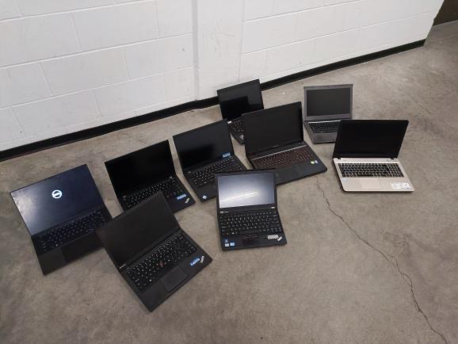
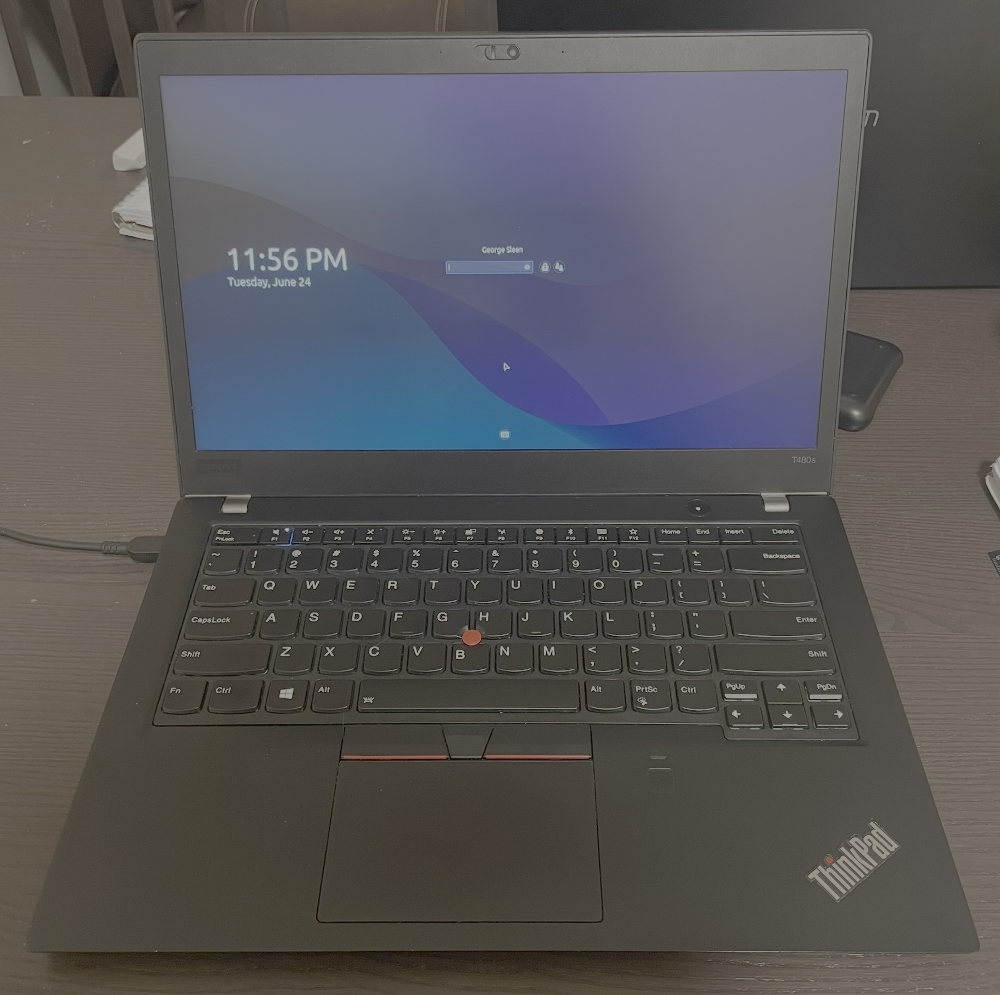
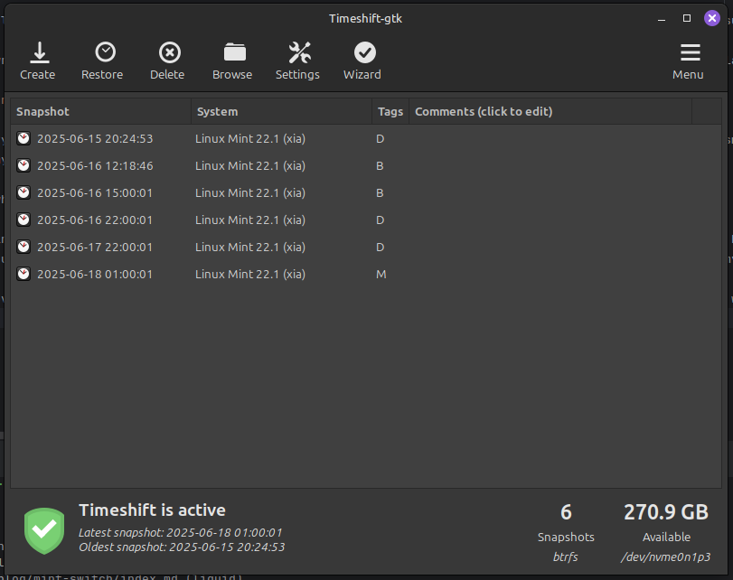

# BTRFS and my new laptop

## E-waste treasure

Recently, one of my good friends found a bunch of old laptops in the e-waste on campus.



Being recently enamoured with the idea of getting a ThinkPad personally, I was really appreciative that he was kind enough to pull one of the T470s models out and give it to me.
It was only missing some SODIMM RAM, and an NVME SSD, which were fairly easy things to come across. I was really happy that it booted up no problem and seemed to have no issues!

I took it home and was impressed by the weight compared to my ROG Zephyrus G14 that I've been carrying around for the past two years.
Although I've been very happy with the Zephyrus, I bought it used, and the battery is definitely starting to show its age. 
My plan was to just take the RAM and storage from my current laptop, shove it in this old ThinkPad, and see what the battery life looked like.
On the Zephyrus I could barely go an hour and a half of actual usage before needing a recharge.

The keyboard was *very* nice to type on too. It even has the page up and down buttons! Very useful for my KiCad work.

Unfortunately, I decided that the laptop needed a deep clean (it did, but not the way I did it). I took some soapy water and just wiped down all the surfaces, keyboard included, and went to boot up the machine.
The enter key didn't work anymore. And neither did any of the keys on the bottom left of the keyboard. It seems like I had accidentally ruined my new laptop in less than a day.

But! I saw some recommendations online to flush out any of the water in the keyboard with a little bit of isopropyl alcohol over the keyboard. This would hopefully just evaporate away the water inside and get everything working again!

Well... Not so much. Turns out that actually disintegrated the plastic of the keycaps, leaving me with even less of a working machine than before.

At this point I was going to have to sink enough money into the laptop that I might as well just upgrade to a quad-core (versus dual-core t470s) T480s on facebook marketplace.

## New laptop, same distro

The more I read about older ThinkPads, the more I wanted one. That small taste of keyboard left me hungry for more, but it seemed like the newer ThinkPad models did away with the amazing keyboard that I was looking for.

The internet seems to settle on the T480 as the golden child of ThinkPads. A good keyboard, and okay specs even today.

Eventually, a pretty good deal on the T480s came up, and I bought it. Over the past year I realized that there's really no need for me to be carrying around enough computing power to play games or do big simulations.
I primarily use my laptop as a web browsing device, and I might as well get what I'm actually looking for. A nice keyboard and good battery life. Also ports. Lots of ports. I was really looking for a laptop with an ethernet port, even though I so rarely use it. After my very ethernet focused co-op, it's become a legitimate priority when buying a laptop.



It's extremely satisfying to use the trackpad buttons in addition to the keyboard.

With the new laptop though, meant this was the perfect time to try out a new linux distribution.
Another one of my friends has been pushing me to try NixOS, so I thought I would give it a legitimate try.


I installed NixOS with GNOME, installed some of the nice packages, and tried it for about a day. I realized that I have no interest in solving a very niche problem by adding a huge headache to using my computer.

If you're not familiar, NixOS is a declarative operating system. That means that an entire system configuration can be rebuilt from a single file. Most other distributions are imperative, meaning you slowly change it to your liking over time. It has a huge package library, and gives you very fine-grained control over your packages.
It's a really cool idea, and I want to like using it. I can't.

I love the idea of having a single file or repo on GitHub that has every package and config file for all the packages I use. But it only took me 5 minutes to recreate the mint installation from my Zephyrus.
I don't feel like fighting my packages to install by editing my config file, when it's a simple ```apt install``` away. I just don't have the problem that NixOS solves.

So I stuck with Mint and Cinnamon.

## BTRFS

One thing I did change between this install and the last one, is the filesystem I use.

Instead of the default 'ext4' filesystem, I chose BTRFS, as I'd heard about the snapshot feature and easy partition (or subvolume) resizing.

BTRFS is a copy on write filesystem, meaning that whenever a 'copy' is made, BTRFS doesn't copy it, but just lets both places point to the same memory. Only when that memory *changes* does a copy get made.


This lets some pretty cool stuff happen, in that you can back up your **entire** partition, with all data, for a pretty small cost. With RSYNC (which is what you'd need on ext4 to make backups), it takes a huge amount of space just to keep a few bootable copies of your system.
With BTRFS, I have my whole 384 GiB partition, with about 90 GiB of actual data, and I still have 270 GiB to spare. That means it's all backed up for only 24 GiB! My old Timeshift files only included some parts of /, and took up 80+ GiB.



It was even useful when I was setting up this website!

I was originally using Hugo's static site generator, but every time I would go to make a change to the website, it was a huge headache to get anything to work. So I finally decided to just let it go.
Now this website is using eleventy as it's static site builder, and it's *so* much easier. I define the css and layouts myself, and there's not an endless chain of missing and fragmented documentation on how it works, because I made it work how I want.

As I was switching over my website to the new model though, I had a point where the GitHub repo storing all my old posts was gone *AND* my local git history and project was deleted. To get that data back, it was as easy as opening Timeshift, going to where it used to be, and copying the new data back to my home folder.

I'll have to see how BTRFS continues to perform, but I can't see myself using anything else into the future if it continues to work as well as it does now.