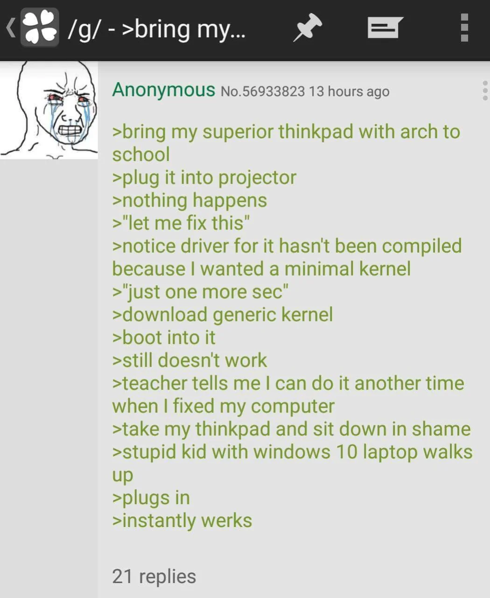
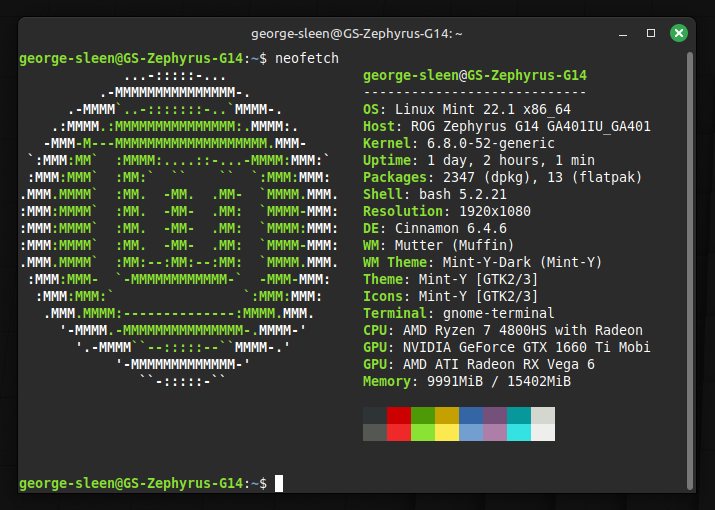

Recently OneDrive has been screwing with my files again,
and since I was upgrading to a one terabyte drive anyway, I thought that I would give linux a chance.

I had been using WSL for a while at this point for a better command line experience, and having had a little experience with Debian on a Raspberry Pi,
I felt pretty confident in switching over to a new operating system.

I did a quick search through different Linux distributions and wanted something that gave me a lot of the perks of using Linux,
while being well-supported and easy to troubleshoot. I'm happy to tinker with software until I get it working,
but this is the machine that I use personally and for school, so I'd rather not be wrangling drivers when a problem set is due in two hours.



I briefly considered Ubuntu, but remembered an old Linus Tech Tips video where he uses Mint and says it's been his favorite distro so far.
I checked out the distro and I thought it looked good, so I got a bootable USB flash drive ready and went to install Mint!

Unfortunately, there are still some things that you can't do without Windows.
SolidWorks in particular was a huge reason why I hadn't made the switch earlier.
So I decided to split my 1T SSD into three partitions: a 250G Windows partition, a 250G Mint partition, and a 500G data partition.

I went and installed the 1T drive into my laptop prepared to boot from the flash drive... but I ran into issues before even getting into the OS.
```grub
Failed to open \EFI\BOOT\mmx64.efi - Not Found
Failed to load image: Not Found
Failed to start MokManager: Not Found
Something has gone seriously wrong: import_mok_state() failed: Not Found
```
This was the test to see if I was prepared to use Linux.

There were many suggestions online on why this was happening, the most common being secure boot being enabled.
I tried a bunch of boot options.
However, none of them seemed to fix it;
eventually I came across a solution that was to rename the file to boot from named "grubx64.efi"
to "mmx64.efi" which looking at the error message seems really obvious.

After this, though, everything was very smooth to set up.
I set up a Windows partition, attempted to install Windows without OneDrive,
but ultimately couldn't be bothered to jump through the INSANE number of hoops required to do so.
I just booted in and disabled it before it could "help" by adding more of my folders and files to OneDrive.
After that, I copied my files over from my old 500G SSD and set up the Mint partition.

I'd never realized just how much bloat is on a Windows installation until I opened up Mint,
and Mint is definitely *not* one of the leanest Linux Distros.
It was shockingly easy to set up all the software that I'd been using on Windows and configure it just how I liked.



I've been daily driving Mint for almost a month now, and while I enjoy it much more than Windows so far, I see why Linux isn't for everyone.
You don't *have* to be proficient with a CLI, but I think that it helps a lot to have that tool when you need it.
I also find that playing around with the OS is quite fun, even though I chose a fairly "beginner" distro. 
For something that "just works" nothing beats OSX and Windows, although Linux Mint is quite close!
