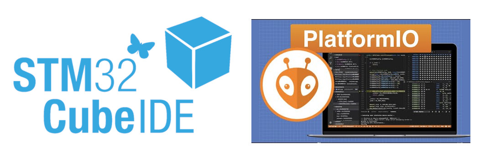

Moving away from Arduino for embedded systems comes with lots of perks,
like live debugging, higher clock speeds, and more performant code.
Unfortunately,
it also means giving up a very nice abstraction layer between your code and bare metal on the microcontroller.

### The Blue Pill

The "Blue Pill" is a little dev board based around the STM32F103 in an arduino nano form factor.
It's a fairly popular and affordable starting point for anyone going beyond the Arduino ecosystem,
and it's well documented by the community which is nice as a novice. 
It can be challenging to source one with legitimate parts, which turns out to be a small headache later.

#


Mine turns out to have a "RESRT" button. Much better than the more common "RESET."

While the reasons above are good reasons to get a Blue Pill in and of themselves,
I know that I'll be using an identical board over the summer during my robot design and competition course.
The competition is colloquially known as "Robot Summer"
and all the second year Engineering Physics students form teams of 4 to design a robot.
Themes have varied since the course (ENPH 253) was introduced,
with the most recent one's goal being to play "Overcooked," but they've all used an STM32 MCU.

#


Last year's Robot Summer competition.

Since I was interested regardless, I bought the least expensive Blue Pill I could find on Amazon.
But only having experience with dev boards that have a USB programming interface enabled by default,
I didn't realize that I wouldn't be able to do anything with the board right away.


I either needed to get a USB to serial converter, or an ST-Link to talk to the board at first.
Since the ST-Link allows for live debugging with breakpoints,
I opted to also buy the cheapest version of that I could find on Amazon as well.
After that, it's possible to load a bootloader with USB communication,
but it lacks some of the awesome features of using an ST-Link, so I haven't gotten around to doing that yet.

#


### Connecting to the Board

Connecting to the Blue Pill is easy, just connecting power, SWCLK, and SWIO 
should mean that you can talk to the MCU with a little bit of software on your computer.

I went ahead and downloaded stlink-tools to my computer, an open source package for using an ST-Link:

```bash
sudo apt install stlink-tools
```

Then it's possible to probe the computer to see the ST-Link connected to any of the USB ports
(alternatively, lsusb can show you if it's detected on a USB port).

```bash
st-info --probe
```

Which should result in something like this if a board is connected to the SWD interface:

```bash
Found 1 stlink programmers
  version:    V2J46S7
  serial:     1B0024000B2D363637365744
  flash:      131072 (pagesize: 1024)
  sram:       20480
  chipid:     0x410
  dev-type:   STM32F1xx_MD
```

Great!
It seems like everything is working no problem,
even though all of these ST-Link V2s with the thumb-drive shape are clones.
It even seems like my Blue Pill has 128KiB of flash, even though some only come with 64KiB.

### Programming with PlatformIO

Once I confirmed that everything seemed to show up, the next step was to upload some code to the Blue Pill.
I had a few options to look at, but the big two I was familiar with were the STM32CubeIDE and PlatformIO.

#



#

STM32CubeIDE is STMicroelectronics' offering of IDE, designed specifically for their boards.
It has a LOT of features built in, most of which I don't especially care about for most of my projects,
but it has an interactive microcontroller setup tool which is great for configuring clocks on the board.
I downloaded off their website to try it out, but I really dislike fragmenting coding across multiple IDEs.
After opening it, I also very much disliked just how heavy the IDE felt, so I opted to look into other options.

I came across this video on programming by Low Level Learning on YouTube
that goes through flashing an STM32 without an IDE at all,
which was a good jumping off point, but not exactly what I was looking for.

[](https://www.youtube.com/watch?v=YEGKD6JQJyM)

I very much agree with his dislike of large IDE's like ST's.

Compiling just from the command line seems like a lot of fun,
and is something I want to try in the future, but my priority was to get code flashed on the Blue Pill.
After a little more digging, I found out about PlatformIO, which hit a lot of my boxes.

It's integrated right into popular IDEs like VSCode and most of the JetBrains IDEs.
Even though I don't like big IDEs like CubeIDE, I have a soft spot for JetBrains tools.
I downloaded the plugin for CLion, and everything was super easy to set up.
I picked the MCU model, the STM32F103C8T6,
and chose the Arduino hardware abstraction layer (HAL) to test out PlatformIO.

I wrote the hello world of the embedded world, a blinky light, and went to flash it to the Blue Pill.
Unfortunately, this was where I paid the price for getting the cheapest ST-Link I could find,
even though the fix turns out to be quite simple.

### Troubleshooting clones

Whenever I tried to upload my code to the board, everything would compile fine,
but communicating with the board always gave this error:

```
Warn : UNEXPECTED idcode: 0x2ba01477
Error: expected 1 of 1: 0x1ba01477
in procedure 'program'
** OpenOCD init failed **
shutdown command invoked

*** [upload] Error 1
```

Seems like a pretty easy fix, so I googled the error,
and lots of other people seemed
to get the same thing because the ST-Link is built with a clone of the real chip from ST
(which has CPUTAPID = 0x1ba01477).

The first suggestion was to add: 

```platformio.ini
upload_flags: -c set _CPUTAPID 0x2ba01477
```

Which doesn't work because set _CPUTAPID (notice the leading underscore) isn't an argument that makes sense to openOCD,
the open source debugger and in-system programmer used by platformIO.
Had I simply read through the documentation for openOCD,
I would have quickly realized my error, but I spent a little more time googling with everyone else recommending to add:

```platformio.ini
upload_flags: -c set CPUTAPID 0x2ba01477
```

to my platformio.ini file.

Eventually, when I turned to the dark side and asked ChatGPT to help (big mistake).
I generally find ChatGPT
to be a good place to find new ideas for debugging when you've run out of relevant Google searches,
but this time it led me on a wild goose chase configuring custom compilation files.
Which didn't work for the same reason as the default compilation wouldn't flash my Blue Pill,
the link between OpenOCD and my ST-Link was broken.
After a while, I was so fed up
with trying to get things to run that I put everything away for a day to come back and try another time.

The next day I opened up my terminal and just tried to get OpenOCD to work, which turned out to be pretty easy.
I also noticed my mistake from yesterday with changing the CPU TAP ID,
but decided to reduce some variables and still try OpenOCD on its own.

```Bash
openocd -f interface/stlink.cfg -f target/stm32f1x.cfg -c "set CPUTAPID 0x2ba01477"
```

which seemed to give me the same error:

```
Open On-Chip Debugger 0.12.0
Licensed under GNU GPL v2
For bug reports, read
	http://openocd.org/doc/doxygen/bugs.html
Info : auto-selecting first available session transport "hla_swd". To override use 'transport select <transport>'.
Info : The selected transport took over low-level target control. The results might differ compared to plain JTAG/SWD
0x2ba01477
Info : Listening on port 6666 for tcl connections
Info : Listening on port 4444 for telnet connections
Info : clock speed 1000 kHz
Info : STLINK V2J46S7 (API v2) VID:PID 0483:3748
Info : Target voltage: 3.208438
Warn : UNEXPECTED idcode: 0x2ba01477
Error: expected 1 of 1: 0x1ba01477
```
I was pretty frustrated at this point,
but I finally ended up finding a forum post that said to set the TAP ID before anything else after a few hours.
I tried it, and it seemed to finally work; the light on my ST-Link started to blink as well!

```
$  openocd -c "set CPUTAPID 0x2ba01477" -f interface/stlink.cfg -f target/stm32f1x.cfg
Open On-Chip Debugger 0.12.0
Licensed under GNU GPL v2
For bug reports, read
	http://openocd.org/doc/doxygen/bugs.html
0x2ba01477
Info : auto-selecting first available session transport "hla_swd". To override use 'transport select <transport>'.
Info : The selected transport took over low-level target control. The results might differ compared to plain JTAG/SWD
Info : Listening on port 6666 for tcl connections
Info : Listening on port 4444 for telnet connections
Info : clock speed 1000 kHz
Info : STLINK V2J46S7 (API v2) VID:PID 0483:3748
Info : Target voltage: 3.208438
Info : [stm32f1x.cpu] Cortex-M3 r2p0 processor detected
Info : [stm32f1x.cpu] target has 6 breakpoints, 4 watchpoints
Info : starting gdb server for stm32f1x.cpu on 3333
Info : Listening on port 3333 for gdb connections
```

I went back to platformIO and changed my configuration file to what it should have been the first time.

```platformio.ini
[env:bluepill_f103c8]
platform = ststm32
board = bluepill_f103c8
framework = arduino

upload_flags:
    -c set CPUTAPID 0x2ba01477
```

Success! Everything compiled and now my light is blinky.

But the really cool thing to do with SWD is to have live debugging,
so I tried hitting the debug button in CLion but came up against the same error of a mismatched CPUTAPID.
This time, I was prepared.
With just a little more forum searching, I saw that I just needed to add this to my configuration file:

```platformio.ini
debug_server =
    openocd
    -c "set CPUTAPID 0x2ba01477"
    -f
    interface/stlink.cfg
    -f
    target/stm32f1x.cfg
```

<video controls autoplay muted loop style="max-width: 100%; height: auto;">
  <source src="live-debugging.mp4" type="video/mp4">
  Your browser does not support the video tag.
</video>

In the bottom right you can see the LED turn on add off with the code I'm stepping through.

### Future plans

Being able to step through my microcontroller's code in real time is extremely cool,
and it makes debugging complex programs much easier.
The next thing I want to tackle is using the STM32 HAL,
as it seems to be much more performant and gives you much more control over the MCU,
while maintaining the portability and readability that makes a HAL so attractive.
